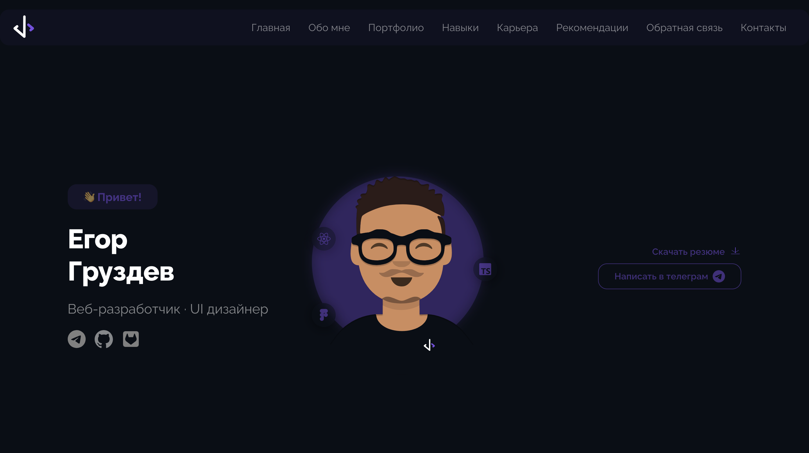
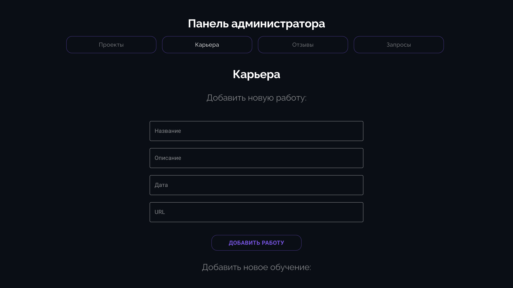

# Проект: Admin Panel & Portfolio Website with Admin Panel

## Описание проекта

Этот проект представляет собой портфолио веб-сайт с административной панелью для управления контентом. Он построен на React с использованием TypeScript и Zustand для управления состоянием. Административная панель позволяет добавлять, редактировать и удалять контент, такой как проекты, карьерные достижения, отзывы и запросы.

## Стек технологий

Frontend:

React с TypeScript
Zustand для управления состоянием
MUI для компонентной библиотеки и стилизации
React Router для навигации
Zod для валидации форм
React Hook Form для работы с формами

Backend:

Express для серверной части
Nodemailer для отправки email
uuid для генерации уникальных идентификаторов

## Основные функции

Пользовательская часть:

Отображение портфолио проектов, а так же основной информации обо мне
Форма отправки заявки (с отправкой данных на сервер)
Адаптивная верстка для мобильных устройств

Административная панель:

Раздел "Проекты": Добавление, редактирование и удаление проектов
Раздел "Карьера": Управление карьерными записями и учебными достижениями
Раздел "Отзывы": Просмотр и удаление отзывов
Раздел "Запросы": Просмотр и удаление запросов, отправленных через контактную форму
Защищенный вход с использованием пароля для доступа в админ-панель

## Установка

Клонируйте репозиторий:

git clone https://github.com/cronixXV/React_Diploma

Установите зависимости:

cd react-diploma
npm install

Создайте файл .env и укажите следующие переменные окружения:

VITE_ADMIN_PASSWORD=ваш-пароль

Запустите проект:

npm run dev

Для запуска серверной части:

npm run start:server

## Использование

Административная панель
Для доступа к административной панели введите пароль, указанный в переменной окружения VITE_ADMIN_PASSWORD.

Проекты: Добавляйте новые проекты, редактируйте существующие и удаляйте их при необходимости.
Карьера: Управляйте вашими записями о работе и учебе.
Отзывы: Просматривайте отзывы пользователей и удаляйте ненужные.
Запросы: Просматривайте заявки, отправленные через контактную форму, и удаляйте обработанные запросы.

Портфолио
Просмотрите проекты, отзывы, а также отправьте заявку на сотрудничество через форму обратной связи.

## Скрипты

npm run dev — запуск проекта в режиме разработки
npm run build — сборка проекта для продакшн
npm run server — запуск серверной части

# Лицензия

